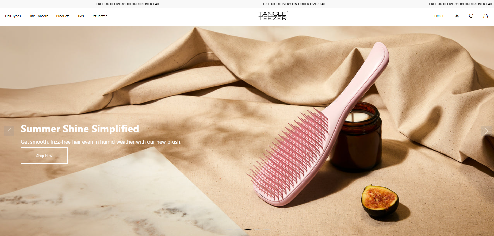
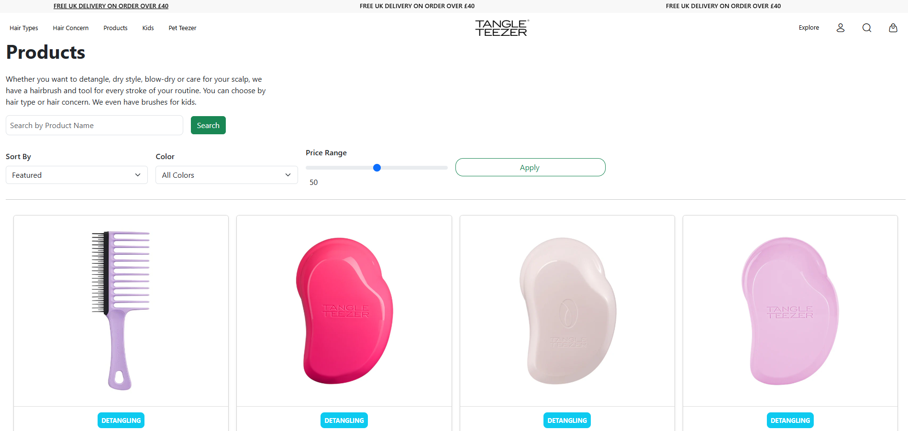

<h1><b>🛍️ Tangle Teezer - E-commerce Website Clone</b></h1>

A sleek and modern e-commerce website clone of <b>Tangle Teezer</b>, crafted using <b>HTML</b>, <b>CSS</b>, <b>Bootstrap 5</b>, and <b>JavaScript</b>. This project integrates essential online shopping functionalities such as product rendering via <b>JSON</b>, sorting, filtering, detailed product views, and authentication-based cart access.

🌐 <b>Live Demo:</b> <a href="https://tangle-teezer.vercel.app/" target="_blank" rel="noopener noreferrer">https://tangle-teezer.vercel.app/</a>

<h1><b>🖼️ Website Preview Images</b></h1> 

<b>1️⃣ Home & Product Listing Page</b>
 
 

This showcases the homepage featuring a sleek, modern layout built with Bootstrap 5. It displays a grid of product cards dynamically loaded from a JSON data source. Users can easily sort and filter products by categories, price, and ratings with intuitive UI controls visible on the side panel.

<b>2️⃣ Product Details & Cart Access</b>

 

This image displays the product detail page where users can view a large product image, detailed description, price, and customer reviews. The “Add to Cart” button is prominently placed but only becomes active once the user is logged in, enforcing authentication. The cart icon in the navigation bar also reflects this behavior by prompting login/signup if the cart is accessed without authentication, ensuring a secure shopping flow.

<b>🚀 Features</b>

<ul>
  <li>Product listing using dynamic JSON data.</li>
  <li>Filter by category and sort by price.</li>
  <li>Dedicated product description pages.</li>
  <li>Interactive cart with add/remove item capability.</li>
  <li>Authentication system (Signup/Login) with local data check.</li>
  <li>Cart access blocked for unauthenticated users.</li>
  <li>Responsive UI built with Bootstrap 5 and custom CSS.</li>
</ul>

<b>🛠️ Technologies Used</b>

<b>HTML</b>, <b>CSS</b>, <b>Bootstrap 5</b>, <b>JavaScript</b>, <b>JSON Server</b> (for mock backend).

<b>📁 Project Structure</b>

<pre>
TANGLE-TEEZER/
├── Assets/                 # GIFs, Screenshots, Icons
├── Pages/                  # Other pages (Login, Cart, Product Details, Profile)
│   ├── product.html
│   ├── cart.html
│   ├── login.html
│   ├── profile.html
│   └── description.html
├── index.html              # Homepage (Main entry point)
├── style.css               # Custom styling
├── media.css               # Additional CSS (e.g., media queries)
├── script.js               # Main JS logic for interaction and DOM handling
├── db.json                 # JSON Server mock data
├── package.json            # Node dependencies and scripts
└── README.md               # Project documentation
</pre>

<b>📌 How to Run</b>

<ol>
  <li>Clone the repository: 
      <code>git clone https://github.com/your-username/tangle-teezer.git</code>
  </li> 
  <li>Install dependencies (if using JSON server): 
      <code>npm install</code>
  </li> 
  <li>Start the mock server: 
      <code>npm start</code>
  </li> 
  <li>Open <code>index.html</code> in your browser or use a live server.</li>
</ol>

<b>🤝 Contribution</b>

Have suggestions or want to improve this clone? Fork the repository and submit a pull request. All contributions are welcome!

<b>📄 License</b>

This project is licensed under the MIT License. See the <a href="LICENSE">LICENSE</a> file for more details.

<i>Made by Rohit Pakhre.</i>

